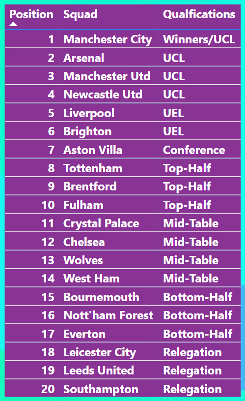

# Premier League 2022/2023 season

## Introduction
---

This topic, **Premier League 2022/2023 season** was approved as my Project after completion of my Data Analysis course. It explores match stats, player and team performances, top scorers to defensive records alongside with the dashboard to give the analytic representation of the data and statement of the problem

## Problem Statement

1.	Poor performance of some teams in the premier league
2.	How Number of Touches affect the General Performance of a Team
3.	Accessibility and Usability: Current analytics platforms may lack user-friendly interfaces or accessibility features, hindering the ability of stakeholders to easily navigate and interpret the data.
4.	Limited Predictive Insights: While historical statistics are readily available, there is a gap in leveraging this data to generate predictive insights and forecast outcomes for upcoming matches or seasons.
5.	Complexity in Data Interpretation: With a vast amount of data available, there is a challenge in distilling actionable insights that can inform strategic decisions for clubs, coaches, and fantasy football enthusiasts

## Data Sourcing

The above problems played a major role in getting this data from the Premier league website and FBREF.COM
The data contains 6 Sheets/tables:
-	Defensive premier_league_stats: 20 rows, 19 columns
-	Player premier_league_stats: 568 rows, 18 columns
-	Possession_premier_league_stats: 20 rows, 23 columns
-	Squad_premier_league_stats: 20 rows, 27 columns
-	Squad_premier_league_stats(2): 20 rows, 12 columns

## Data Cleaning and Transformation

This data was effectively cleaned and transformed using Power query editor of Power Bi.some of the steps are;
1.	Addition of a new column, Goal Conceded which was sourced to enhance effective analysis of the data.
2.	Changing of column names to enhance better understanding of the data e.g 'poss' as 'Possession', 'Att Gls' as 'Attempted Goals', 'Ass' as 'Assisted Goals' and lots more

## Data Modeling

The different sheets/tables are automatically connected by Power BI in a star schema(one to many). The Defensive_premier_league_stats is the fact table. The other tables are called dimensions table and are connected to the fact table.

# Analysis 
You can interact with this by clicking [here](https://app.powerbi.com/groups/me/reports/08b62829-ebc0-4ef7-8f13-619c81d800f0/ReportSection?experience=power-bi)
---

This Premier League dashboard serves as a valuable tool for providing actionable insights and facilitating data-driven decision-making in the context of one of the world's most prestigious football competitions.
In summary, This visualization explains how the general performance of each team in the league is being affected by some statistics that have been explained below;
- The league table
- Top 5 goal scorers
- Top 5 teams with most Assists
- Top 5 Teams with most Possession
- Top 8 teams with ther number of touches
- Slicers(Squad and Qualifications)

## The League Table

This table shows the total number of teams that played in the 2022/2023 premier leagues season, their positions at the end of the season and their qualification awards.
At the end of the season, the team with the most point comes top and other teams follow suit in descending order.
The first four teams at the end of the season automatically qualifies for the UEFA Champions league while the 5th and 6th position qualifies for the UEFA Europa League. Leaving the 18th , 19th  and 20th teams in that position for relegation to a lower league.

