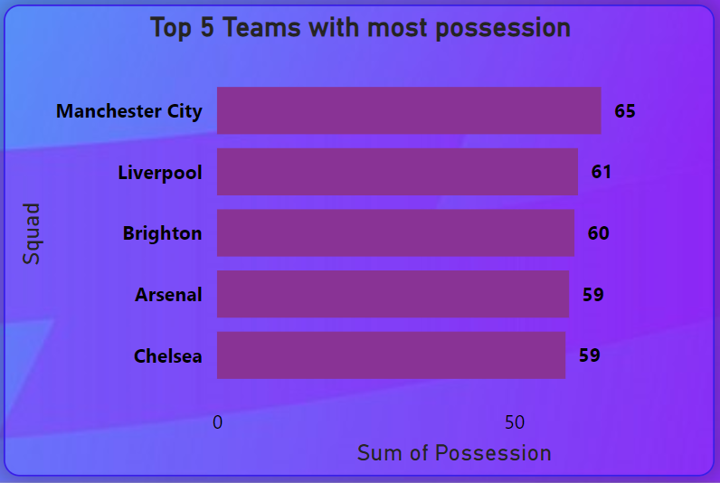

# Premier League 2022/2023 season

## Introduction
---

This topic, **Premier League 2022/2023 season** was approved as my Project after completion of my Data Analysis course. It explores match stats, player and team performances, top scorers to defensive records alongside with the dashboard to give the analytic representation of the data and statement of the problem

## Problem Statement

1.	Poor performance of some teams in the premier league
2.	How Number of Touches affect the General Performance of a Team
3.	Accessibility and Usability: Current analytics platforms may lack user-friendly interfaces or accessibility features, hindering the ability of stakeholders to easily navigate and interpret the data.
4.	Limited Predictive Insights: While historical statistics are readily available, there is a gap in leveraging this data to generate predictive insights and forecast outcomes for upcoming matches or seasons.
5.	Complexity in Data Interpretation: With a vast amount of data available, there is a challenge in distilling actionable insights that can inform strategic decisions for clubs, coaches, and fantasy football enthusiasts

## Data Sourcing

The above problems played a major role in getting this data from the Premier league website and FBREF.COM
The data contains 6 Sheets/tables:
-	Defensive premier_league_stats: 20 rows, 19 columns
-	Player premier_league_stats: 568 rows, 18 columns
-	Possession_premier_league_stats: 20 rows, 23 columns
-	Squad_premier_league_stats: 20 rows, 27 columns
-	Squad_premier_league_stats(2): 20 rows, 12 columns

## Data Cleaning and Transformation

This data was effectively cleaned and transformed using Power query editor of Power Bi.some of the steps are;
1.	Addition of a new column, Goal Conceded which was sourced to enhance effective analysis of the data.
2.	Changing of column names to enhance better understanding of the data e.g 'poss' as 'Possession', 'Att Gls' as 'Attempted Goals', 'Ass' as 'Assisted Goals' and lots more

## Data Modeling

The different sheets/tables are automatically connected by Power BI in a star schema(one to many). The Defensive_premier_league_stats is the fact table. The other tables are called dimensions table and are connected to the fact table.

# Analysis 
You can interact with this by clicking [here](https://app.powerbi.com/groups/me/reports/08b62829-ebc0-4ef7-8f13-619c81d800f0/ReportSection?experience=power-bi)
---

This Premier League dashboard serves as a valuable tool for providing actionable insights and facilitating data-driven decision-making in the context of one of the world's most prestigious football competitions.
In summary, This visualization explains how the general performance of each team in the league is being affected by some statistics that have been explained below;
- The league table
- Top 5 goal scorers
- Top 5 teams with most Assists
- Top 5 Teams with most Possession
- Top 8 teams with ther number of touches
- Slicers(Squad and Qualifications)

## The League Table

This table shows the total number of teams that played in the 2022/2023 premier leagues season, their positions at the end of the season and their qualification awards.
At the end of the season, the team with the most point comes top and other teams follow suit in descending order.
The first four teams at the end of the season automatically qualifies for the UEFA Champions league while the 5th and 6th position qualifies for the UEFA Europa League. Leaving the 18th , 19th  and 20th teams in that position for relegation to a lower league.

## Top 5 Goal scorers

This Chart provides us with the top 5 goal scorers in the 2022/2023 season with Erling Haaland having the most goals,36 followed by Harry Kane,30 goals and others. The number of goals scored by a player in a season simply means the number of times a player hits the back of the net and contributes to their team’s success by putting the ball past the opposing Goalkeeper. Goal scorers are often praised for their skill, accuracy and ability to create scoring opportunities.

## Top 5 teams with most Assists

This Table gives an insight on the Top 5 players with highest number of Goal Assists during the 2022/2023 season. Assists is the number of time a player directly contributes to a goal by providing a pass or assist to a teammate who scores. It measures the ability of a player to set up goals for their team. With Kevin De Bruyne at the top having 16 Goal Assists, this simply shows that he has 	the highest contribution to goals scored through out the 2022/2023 season.

## Top 5 Teams with most Possession

When a team has more possession, they have more control over the ball and can dictate the pace of the game. Possession allows them to build up their attacks, create scoring opportunities and ultimately increase their chances of scoring goals. The table above shows Manchester city has the highest possession throughout the 2022/2023 season thereby contributing to their outstanding performance.

## Top 8 teams with ther number of touches

The above table gives detailed explanation on how Touches affects the general performance of a team.
The number of touches a team has at the end of the season determines how they play, number of passes they make, number of shots and shots on target they make and number of goals they score. If a team utilizes their touches very well, it simply affects their general performance positively.
We can see that Manchester city has the highest number of touches and that got them into the first position and also qualifying them for the UEFA Champions league

## Slicers
The slicers (Squad and Qualification) in this visualization  helps to narrow down the visualization to a particular Squad or team. The visualization will be limited to Any selection made on the slicer.
An Example will be explained below with selecting  Manchester City on the Squad slicer in the conclusion page.

## Conclusion

This Chart gives some important explanation as to how Manchester city won the 2022/2023 premier league season
	Manchester city with Position 1 out of 20 teams, has a total of 92 goals(1039) and 69 goal assist (726).  This means Manchester city contributed 8.85% of the total goals scored  and 9.50% of assists made by all 20 teams in the 2022/2023 premier league season respectively.
The table also gives the following details;
- Top 5 scorers In Manchester city with Haaland Having the most goals, 
- The average age of the players in the Team
- The number of touches made by Manchester city throughout the 2022/2023 season
- The possession and shots on target of the team which contributes to the performance of the team.
 	In conclusion, the above listed points, shows us some of what might have contributed to manchester city having a successful premier league season. 😃

## Recommendation

Every team that wants to have an outstanding performance like Manchester city did needs to employ players that have more scoring abilities like Erling Haaland, and goal contribution skill like Kevin De Bruyne. These players alongside other players contribution gave Manchester city an edge at the Peak of the 2022/2023 premier league season.
A team needs to work on their ball possession ability which is; building up their attacks, having more touches, more control on the ball, more shots, shots on target and also creating scoring chances.
 I believe the points above if adhered to, will help every other team attain their respective desired performances. 🤓

